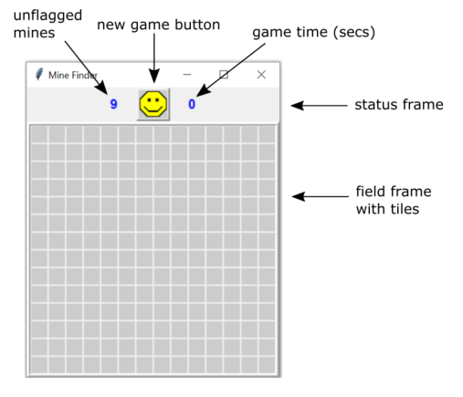
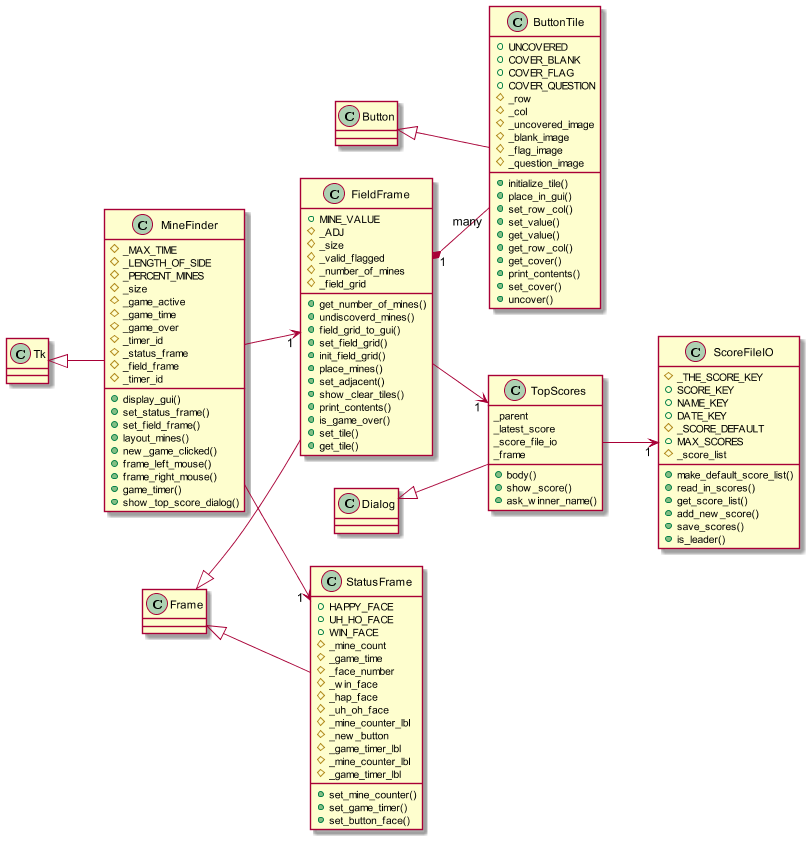

**Mine Finder Game**

This game repoduces one that came with older versions of Microsoft Windows. The game is not completely fathful to the original, but is very playable. It's written in python and uses tkinter for the GUI. I wrote this as a way to learn some python and tkinker programming and apply best practices.

**Game terms:**
- _tiles_, the mine field is a row-column matrix of tiles
- _covered_ or _uncovered_, a tile's two main states
- _tagged_, a covered tile can be tagged with flag or question mark, or none (untagged)
- an _uncovered_ tile shows it's value. The value can be blank, a number from [1..8], or a mine
- _numbered tile_, a count of tile's adjacent mines, you use this to locate and flag mines
- _flag_, you right click a tile to flag it as a mine location, note the tile may not actually contain a mine
- _question mark_, you right click a tile to question it as suspected mine location, it's like a place holder to fix later

**How to play:**
1. the game starts with all tiles covered
   1. left click on a tile to uncover it, the value can be blank, a number [1..8], or a mine
      1. if blank, the game will uncover any adjacent blank recursively
         1. if the tile is a number then only that tile is uncovered, the recursion stops on numbered tiles
      1. if a mine then game over
   1. right click on a tile to tag it with a flag or question mark
      1. continuing to right click will cycle through the above plus blank
      1. you can only left click on untagged tiles
1. the game is over if you uncover a mine (lose), or flag each mine and uncover all other tiles (win)
1. the time is kept while you play
1. at the end of a game the program shows you the top scores dialog,
   1. if your time is among the top (low) scores the program asks for a name and adds it to the top scores.

**Code Description:**

The program is written as all classes with the exception of one module function. There is a structural mistake; the game itself is tightly integrated with the gui programming with the fieldframe buttontile classs. The heart of the game coding is FieldFrame._field_grid, it is a dictionary with keys using a row,column name and a buttontile value. There are about 7 methods that actual 'run' the game.

The FieldFrame is the mine field. It's a square matrix of button tiles the side is set from  MineFinder._LENGTH_OF_SIDE and MineFinder._PERCENT_MINES as a percentage of the total matrix. Adjust these two contants to change the game size and difficulty.

The class diagram is shown here. It was developed using plantUml.

Class Diagram

Using right and left mouse clicks changes the state of a tile as follows.

**Future enhancements**
1. Separate the game from the gui. This is certian introduce some inefficiences, but the result is a better program.
1. Add an extra list for the mines, and then use that list set adjacencies, find mines, and etc.

